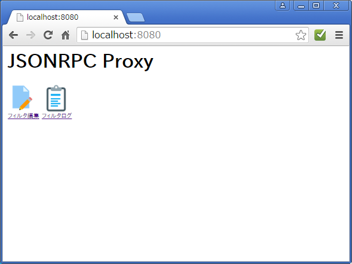
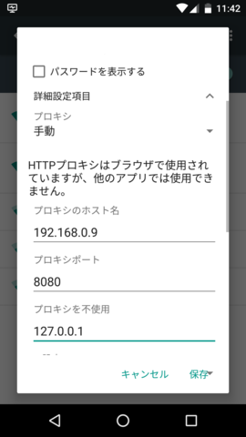
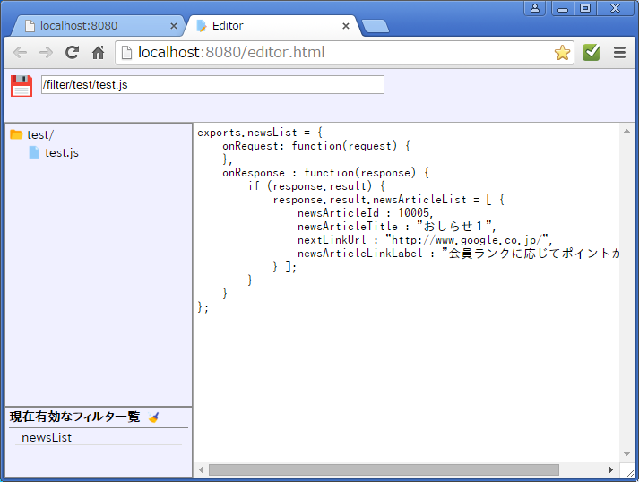
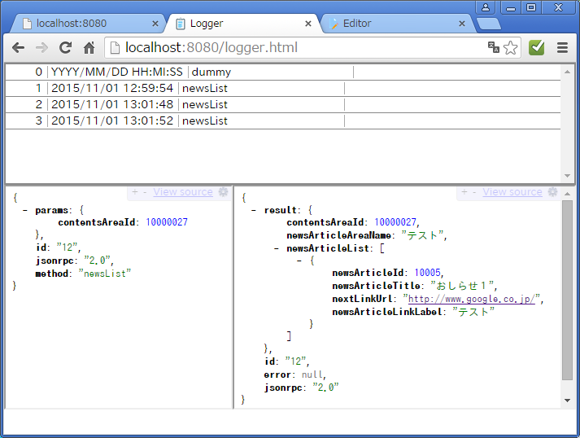
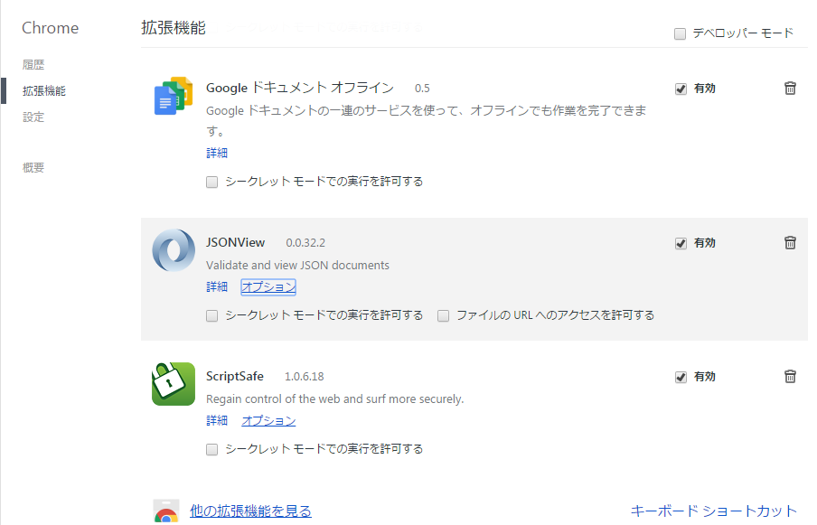
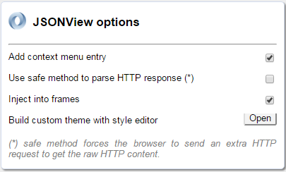

# JSONRPC Proxy

## 概要

汎用JSONRPCプロキシサーバです。 
NodeJS v0.10.25 で構成されています。

## 起動方法

NodeJSをインストールして app.js を実行するだけです。

		> node.exe app.js

  * OSには依存しないはずです。
  * デフォルトのポートは 8080 です。

localhost:8080 にアクセスして以下の画面になれば起動しています。

## クライアント側設定

ブラウザのプロキシにこのアプリを設定します。

自ホストのIPを確認。

	> ipconfig
	Windows IP 構成
	イーサネット アダプター ローカル エリア接続:
	   接続固有の DNS サフィックス . . . :
	   IPv4 アドレス . . . . . . . . . . : 192.168.0.9
	   サブネット マスク . . . . . . . . : 255.255.255.0
	   デフォルト ゲートウェイ . . . . . : 192.168.0.1

Androidの設定例:

## フィルタの使い方

フィルタはJSONRPCの通信に割り込んでJSONのリクエスト・レスポンスを加工する機能です。 
フィルタは JavaScript で記述します。書式は NodeJS のモジュール定義に準拠します。

### フィルタの定義

docroot/filter の配下に JS ファイルを置いて関数を定義します。

  * docroot/filter/test/test.js

		exports.newsList = {
			onRequest: function(request) {
				request.param.hoge = "test request data";
			},
			onResponse : function(response) {
				if (response.result) {
					response.result.hoge = "test response data";
				}
			}
		};

  * exports のプロパティ名に JSONRPC のメソッド名を指定します。
    * 複数の定義が可能です。
  * onRequest にリクエストパラメータの差し替え関数を設定します。
    * ターゲットサーバにリクエストを転送する前に呼ばれます。
  * onResponse  にレスポンスの差し替え関数を設定します。
    * ターゲットサーバからレスポンスを受けた後に呼ばれます。
  * 変数 this は onRequest/onResponse のペアで共通です。

### エディタ

トップページの「フィルタ編集」をクリックします。

  * 左側のファイル一覧からファイルをクリックするとソースが読み込まれます。
  * 編集後に  をクリックすると保存・適用されます。
  * 適用されたフィルタのメソッド名は「現在有効なフィルタ一覧」に表示されます。
  *  をクリックするとフィルタはクリアされます。

### ログ

トップページの「フィルタログ」をクリックします。

  * 上：フィルタ実行ログ一覧。
  * 左：リクエストJSON
  * 右：レスポンスJSON

  * 有効になっているフィルタの実行ログがリアルタイムに追加されます。
  * ログ一覧の項目をクリックすると対応する JSON が表示されます。(*1)

(*1)chromeプラグイン JSONView を使っています。

### JSONView の設定

ここからプラグイン追加。

  * https://chrome.google.com/webstore/detail/jsonview/chklaanhfefbnpoihckbnefhakgolnmc

オプション設定から 「Inject into frames」 を有効に設定。

　

-----
